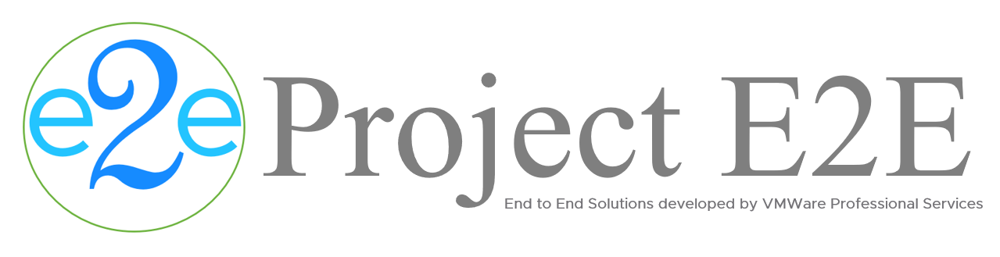
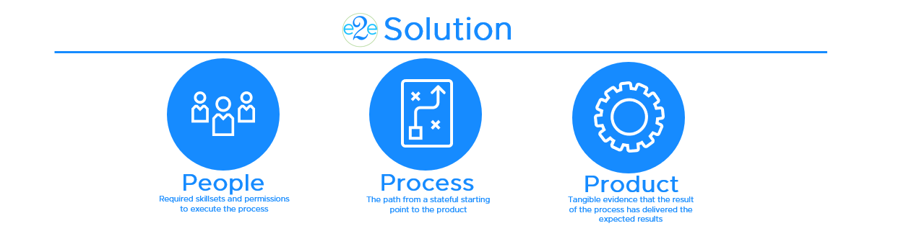

# About Project E2E
Project E2E is an initiative by VMWare Professional Services to streamline the delivery of end to end (E2E) solutions. In this context, a solution is defined as follows:

** Gartner's definition of an enterprise solution **

>An enterprise solution is designed to integrate multiple facets of a company’s business through the interchange of information from various business process areas.
A solution portfolio defines the relationship among implemented solutions of a particular type (such as an application, or shared infrastructure) in order to coordinate change across those solutions. Applying a portfolio approach to managing solutions as a group, while also managing the relationship across portfolios, improves consistency, interoperability, and portability of the collection of solutions. 

An E2E solution should therefore explicitly define the **people** and **process** required to generate the expected results of a **product**.



**Success Criteria:**
1. People: should contain roles and skillsets that are normally found in enterprise organizations
2. Process: should be repeatable and should always produce the same result
3. Product: should be tangible and should match exactly to the expected result
4. Level of Effort: The amount of time from beginning to end to complete a process in a perfect scenario (no contingency or buffer)
5. The Level of Effort for a solution should never exceed two weeks (one sprint)
6. The War Room: a round table with enough seats for only the people actively participating in the process
7. The number of people to invite into the War Room should follow the [two pizza rule](https://www.inc.com/business-insider/jeff-bezos-productivity-tip-two-pizza-rule.html)
8. Each E2E solution must demonstrate through a video recording that The War Room can execute the documented process within the defined Level of Effort and can produce the Product repetitively
9. The individual responsible for creating the E2E solution cannot be a member of The War Room

# Getting Started
Deploy [PhotonOS](https://vmware.github.io/photon/) to your laptop using [Fusion](https://www.vmware.com/products/fusion.html) or [Workstation](https://www.vmware.com/products/workstation-pro.html).

Open a PuTTY session and connect to your PhotonOS VM. Navigate to `/usr/local/` directory:
```
cd /usr/local
```

Clone this repository:
```
git clone https://github.com/boconnor2017/vmw-e2e.git
```
